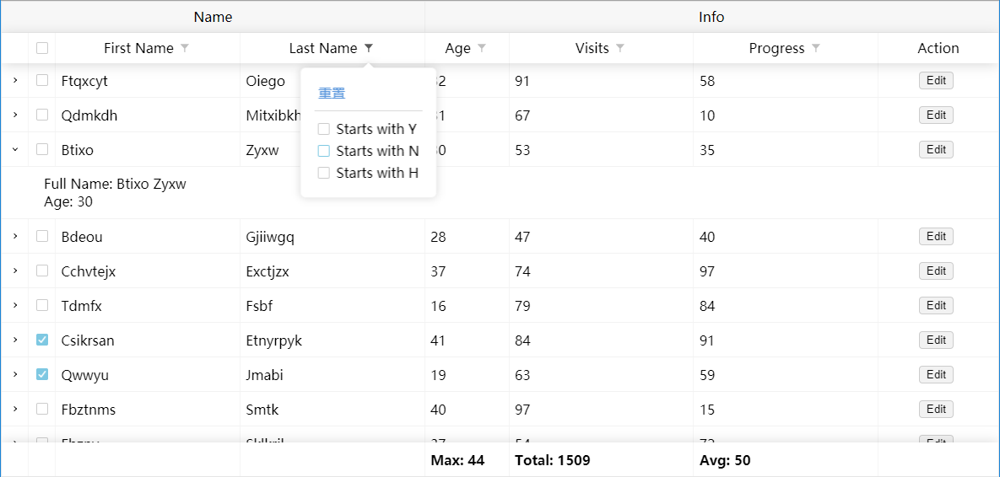

# Flex Table

`flex-table` 是一款原生的表格工具, 其完全基于flex, 没有任何的table相关的html, 可用于快速生成数据表格

`flex-table` 的核心代码只包含表格的基础渲染功能, 其余的所有功能均由 `plugin` 提供, 用户也可以根据自己的使用替换或添加插件




## 开始 (Start)

使用 npm

```bash
npm install --save @qmhc/flex-table
```

```js
import FlexTable from '@qmhc/flex-table'

import '@qmhc/flex-table/dist/flex-table.css'
```

按需引入

```js
import FlexTable from '@qmhc/flex-table/dist/flex-table.core'
import Sorter from '@qmhc/flex-table/dist/plugin/sorter'

import '@qmhc/flex-table/dist/core/flex-table.core.css'
import '@qmhc/flex-table/dist/plugin/sorter.css'
```

使用标签引入

```html
<!-- js -->
<script src="./dist/flex-table.js"></script>

<!-- css -->
<link rel="stylesheet" href="./dist/flex-table.css">
```

按需引入

```html
<!-- js -->
<script src="../dist/core/flex-table.core.js"></script>
<script src="../dist/plugin/sorter.js"></script>

<!-- css -->
<link rel="stylesheet" href="../dist/core/flex-table.core.css">
<link rel="stylesheet" href="../dist/plugin/sorter.css">
```

创建一个表格

```javascript
// 创建表格
const flexTable = new FlexTable({
  container: '#app',
  columns: [{ /*...*/ }],
  data: [{ /*...*/ }],
  plugins: {
      // ...
  }
})
```

按需引入时, 需手动注册插件

```js
FlexTable.registerPlugin('sorter', Sorter)

// 使用标签引入时
FlexTable.registerPlugin('sorter', FlexTable.Sorter)
```

## 例子 (Example)

简单示例见 `example` 文件夹下的 [`index.html`](./tests/index.html)


## 配置 (Config)

一份完整的配置

```javascript
{
  container: '#app',
  columns,
  data,
  className: '',
  id: '',
  rowClassName: (data, index) => '', // index 为数据渲染在表格的行索引
  stripe: true, // 为行添加斑马纹样式
  plugins: {
    selector: {}, // 暂无独立配置项, 只需指定一个空对象
    editor: {
      trigger: 'action', // or 'click'
      // verifier: data => data, // 顶层验证方法
      columnWidth: 142,
      columnName: '操作', // editor 列头
      labels: {
        edit: '编辑',
        save: '保存',
        cancel: '取消'
      }
    },
    resizer: {}, // 暂无独立配置项, 只需指定一个空对象
    sorter: {
      multiple: true, // 开启多列排序功能
      multipleKey: 'shift' // 启动多列排序的按键, 可选 ctrl, alt, shift
    },
    pager: {
      useOptions: true,
      pageOptions: [10, 15, 20, 25, 30],
      currentPage: 1,
      pageSize: 15,
      labels: {
        prev: '上一页',
        next: '下一页',
        row: '行'
      }
    },
    filter: {
      filterAll: true, // 所有类均过滤 (如有列单独设置, 则优先使用列设置, 否则使用默认过滤设置)
      openAction: false, // filter 是否具有开关按钮
      filterOpen: true, // filter 具有开关按钮, 设置是否默认打开 openAction 为 false 时忽略
    },
    layer: {
      loading: false,
      notFound: true,
      delay: 500,
      loadingText: '加载中',
			notFoundText: '无数据'
    },
    scroller: {
      height: 450,
      mouse: true,
      wheel: false,
      wheelDistance: 20
    }
  },
  theme: 'light',
  deepClone: true
}
```

`columns` 的完整配置

```js
{
  name: 'First Name', // 表头列名, 可以是 Number String Array<HTMLElemnt> NodeList HTMLElement
  accessor: data => data.firstName, // 在渲染数据时告诉 FlexTable 该怎么读取数据, 参数为行数据, 返回值参考 name 属性
  key: 'firstName', // 该列的属性名, 这很重要, 保证 FlexTable 能读取到数据的原始值
  footer: data => `Total: ${data.length}`, // 脚部渲染方法, 参数为列数据, 返回值参考 name 属性
  resizable: true, // 是否可以调整列宽
  sortable: true, // 是否可以排序
  defaultSort: 1, // 默认排序 1 正序 2 倒序
  sorter: (prev, next) => prev.toString().localeCompare(next), // 排序的方法
  filterable: true, // 是否可以过滤
  // 可以自定义过滤方法, 参数分别为 accessor 读取后的值, 输入的 filter 值, 数据的原始值
  filter: (value, filter, origin) => {
    if (value.includes(filter)) {
      return true
    }
  },
  filterOptions: {
    type: 'text',
    // options: ['prepare', 'process', 'finish'] // type 为 'select' 时使用
  }
  editable: true, // 是否可以编辑
  editType: 'select', // 编辑控件类型
  editOptions: ['Kegdhi', 'Tshudgh', 'Asihvsit'] // 'select' 时使用
  defaultWidth: 100 // 默认列宽
}
```

<!-- PS: 内置的 `resizer` 插件是基于 `Proxy` 编写的，使用时请注意兼容性 -->

## 主题 (Theme)

`iTable` 内置有四种主题颜色，配置中添加 `theme` 属性可以设置主题

```javascript
{
  theme: 'dark',
  // theme: 'blue',
  // theme: 'red',
  // theme: 'light', // default
  // ...
}
```

如果这不是你想要的主题, 可以参考 `/src/style` 下的 `scss` 文件配置主题

## 插件 (Plugin)

可以根据使用需要 (如实时加载数据) 实现自己的插件, 插件的模版可以参考 [`./src/plugin/temp.js`](././src/plugin/temp.js)

随后, 在 FlexTable 上注册插件

```js
import FlexTable from '@qmhc/flex-table'
import myPlugin from 'my-plugin'

FlexTable.registerPlugin(name, myPlugin)
```

也可以使用 `replacePlugin` 方法替换具体插件

## 授权 (License)

[MIT](./LICENSE)
